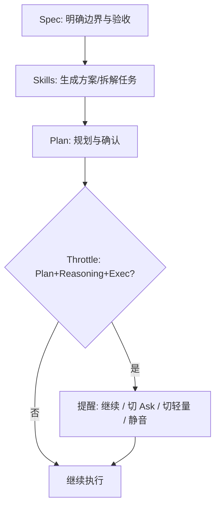

# Throttle

> A runtime co-pilot for AI usage in your IDE.  
> 一个运行时“副驾驶”：在你即将踩深油门之前，提醒你可能在错误的模式/模型上过度加速。

## What is Throttle?

Throttle **不是** AI 助手，也不会替你做决定。

Throttle 是一层**调用前（pre-call）**的运行时提示系统：
- 识别 **Plan / Agent / Ask / Debug** 模式与用户意图的错配
- 在高风险场景下给出冷静、非权威的提醒与可选路径（继续/切模型/切模式）
- 默认尽量不打扰：宁可漏报，不要误报

## Why it exists

AI IDE 的成本从“订阅席位”变成“推理消耗”。  
问题不在于你不会用，而在于**人类在实际开发中会无意识过度使用高推理模型**——尤其在不合适的模式里。

Throttle 的目标是：  
**不让你变慢，只防止你在不合适的地方把引擎踩爆。**

---

## Docs（规范文档）

> 这三个文档是本项目的“基准线”，任何 PR/功能/交互变化必须对齐。

- PRD (Canonical): `docs/prd.md`
- Rule Engine Spec: `docs/rule-engine-spec.md`
- UX Constitution: `docs/ux-constitution.md`

---

## Current Status

- Stage: **MVP / Demo-ready**
- Platforms: **VS Code Extension**（Cursor 兼容目标）
- v0.1 Focus: **Mode-aware Overkill Detection**（先做最关键的一条规则）

---

## MVP Scope (v0.1)

### R001 — Plan + Reasoning + Execution intent ⇒ nudge

当满足以下条件时提示：
- 当前模式是 **Plan**
- 当前模型等级是 **Reasoning**（如 Opus / o1 / thinking 类）
- Prompt 意图是**执行/实现**（写代码/实现/生成代码/patch/refactor 等）

提示遵循 UX Constitution：
- **Pre-call**
- **Non-blocking**
- **Non-judgmental**

---

## Install / Run (Dev)

> 适用于本地开发与调试扩展（Extension Development Host）。

### Prerequisites
- Node.js（建议 LTS）
- npm

### Setup
```bash
npm install
npm run build
```

## Dev (Run Extension Host)

1. Open the repo in VS Code
2. Run and Debug → Run Extension
3. Extension Development Host will open
4. Use Command Palette to run Throttle commands

## Usage (v0.2.0)

- `Throttle: Set Mode` – set mode and model tier (stored per workspace)
- `Throttle: Safe Submit` – evaluate before sending using stored mode/tier or prompt tags
- `Throttle: Safe Submit (Clipboard)` – uses clipboard text as prompt (fast path)
- Status bar shows current mode/tier (and muted count); click to quick switch
- Status bar includes a quick "Throttle: Submit" entry for clipboard submit
- Default keybinding: `Cmd+Shift+Enter` on macOS, `Ctrl+Alt+Enter` elsewhere (editor focus)
- Clipboard keybinding: `Cmd+Enter` on macOS, `Ctrl+Enter` elsewhere (editor focus)
- `Throttle: Reset Muted Rules` – clear muted rules
- `Throttle: Quick Switch` – quick pick to switch mode or model tier
- `Throttle: Clear Log` – clear log file
- `Throttle: Open Log` – open log file
- `Throttle: Clear Last Hit` – clear last hit indicator

## Settings

- `throttle.enabled`: enable/disable Throttle checks for Safe Submit
- `throttle.statusBar.showMode`: show the mode/tier status bar entry
- `throttle.statusBar.showSubmit`: show the clipboard submit status bar entry
- `throttle.statusBar.showLastHit`: show the last hit indicator
- `throttle.logging.enabled`: enable lightweight output logging (hits only)
- `throttle.logging.mode`: `hit` / `summary` / `both`
- `throttle.logging.debugOnly`: only log in Development mode
- `throttle.logging.fileEnabled`: write logs to a local file
- `throttle.logging.filePath`: log file path (optional)

Prompt tags (optional) override stored mode/tier:
```
[mode:plan] [tier:reasoning] Write code to implement a rate limiter.
mode=ask tier=light Explain this function.
/plan /reasoning Implement a queue worker.
```

> v0.2 goal: auto-detect mode/tier with fewer manual steps.

## Release Checklist (manual)

- Run `npm run build`
- Verify `Throttle: Safe Submit (Clipboard)` flow
- Verify status bar items and settings
- Ensure `assets/icon.png` is present

## Post-Release Check (1 min)

- Open the Marketplace page and confirm the description renders
- Install the extension, run `Throttle: Set Mode`
- Copy an exec-style prompt, press `Cmd+Enter` / `Ctrl+Enter`
- Confirm warning appears and status bar shows last hit
- Optionally toggle settings to hide status bar items

## Acceptance Checklist (2 min)

- `Throttle: Set Mode` → plan + reasoning
- Copy an execution prompt, press `Cmd+Enter` / `Ctrl+Enter` → warning appears
- Switch to ask or light, repeat → no warning
- Mute rule, repeat → no warning
- `Throttle: Reset Muted Rules` restores warning

## Publishing (VS Code Marketplace)

1) Install vsce:
```bash
npm i -g @vscode/vsce
```

2) Login:
```bash
vsce login Lcking
```

3) Package (optional):
```bash
vsce package
```

4) Publish:
```bash
vsce publish
```

## Quick Start (30s)

1) Run `Throttle: Set Mode` → choose `plan` + `reasoning`.
2) In chat, write a prompt like “Write code to implement a rate limiter.”
3) Copy it, then in the editor press `Cmd+Enter` (or `Ctrl+Enter`).
4) You should see the non-blocking warning with Continue as primary.
5) Switch to `ask` or `light` and repeat; the warning should disappear.

## Workflow (text)

1) 你在聊天框里写完提示词并复制。
2) 回到编辑器按 `Cmd+Enter`（或 `Ctrl+Enter`）触发 Throttle 的 Safe Submit。
3) 若命中规则，会出现一个不阻断的提示，主按钮是“继续”。
4) 你可以选择切到 Ask / 轻量模型，或者静音此规则。
5) 日常切换用状态栏的 Quick Switch，静音可用 Reset Muted Rules 恢复。

## Best Practices (Spec × Skills × Throttle)

把 Throttle 放到一个“层层递进、首尾衔接”的开发流程中：

1) **Spec**：先用简短规范明确边界、验收与不可做。
2) **Skills**：用技能/工具生成方案、拆解任务、确认风险点。
3) **Throttle**：在执行前作为“副驾驶提醒”，避免 Plan 阶段直接落地。
4) **Exec**：进入 Ask/Light 或执行模式开始实现。

这个流程的目标不是“省 token”，而是**减少高成本模式下的误用与返工**。

### Visual Flow (Mermaid)



### Behavior Feedback (替代“token 进度条”)

与其显示 token 消耗，不如显示“行为触发与改道次数”：

- **触发次数**：Plan+Reasoning+Exec 被提醒的次数
- **改道次数**：从提醒中切到 Ask/轻量的次数

这能更直接地帮助用户形成“自我优化”的闭环。

## One-Page Quick Start

目标：用最短流程把 Throttle 变成“副驾驶”。

1) **写 Spec（1-3 行）**：范围、验收、禁止事项。
2) **用 Skills 拆解**：生成方案与任务清单。
3) **Plan 模式确认**：明确路径与风险点。
4) **执行前一键触发**：复制 prompt → `Cmd+Enter` / `Ctrl+Enter`。
5) **出现提醒就改道**：切 Ask / 轻量模型；否则继续。

## Template (Copy & Paste)

**Spec 模板**
```
目标：
范围：
验收：
不做：
```

**Plan 模板**
```
背景：
方案：
风险点：
下一步：
```

**Exec 模板**
```
请按以下步骤实现：
1)
2)
3)
输出：
```

## Auto-Interception (shortcut replace)

如果你希望“只提醒但能自动介入”，可用快捷键覆盖方式：

1) 打开 Keyboard Shortcuts (JSON)。
2) 添加以下配置，将 Enter 发送替换为 Throttle 的安全提交：

```json
{
  "key": "enter",
  "command": "throttle.safeSubmitClipboard",
  "when": "editorTextFocus && !editorReadonly"
}
```

> 如果你想保留 Enter 原行为，可改为 `cmd+enter`（mac）或 `ctrl+enter`（win/linux）。

## Roadmap (high level)

- v0.1.1: friction removal (remember mode/tier, readable UI, default Continue)
- v0.2: auto mode/model detection; optional Doc Drift Sentinel
- v0.3 (optional): relative cost hints (no exact billing)

## Contributing

Please follow the UX Constitution (highest bar): `docs/ux-constitution.md`.
See PRD/specs in `docs/`.
